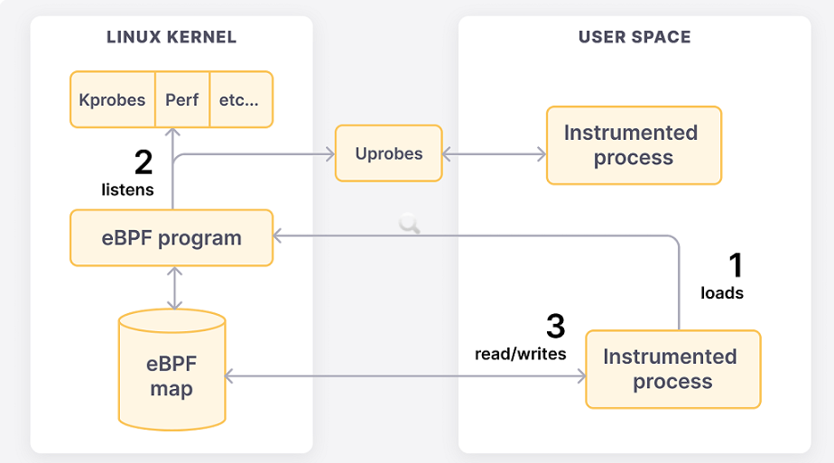
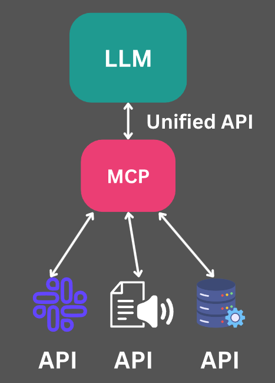
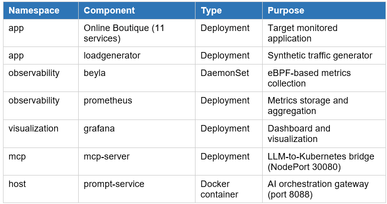
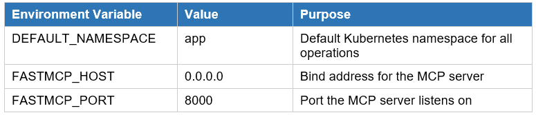
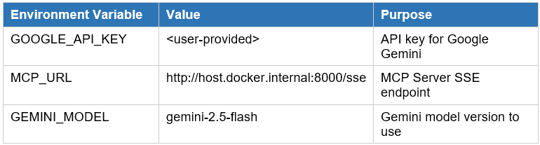

# Project Beyla-I
### Year 2025/2026, Group 4
### Authors
- Piotr Andres
- Antoni Dulewicz 
- Wojciech Fortuna 
- Paweł Podedworny

---
## 1. Introduction
The primary objective of this project is to develop a comprehensive case study focused on modern application observability using Grafana Beyla within an AI-driven management framework. Traditionally, instrumenting an application for deep visibility requires significant manual effort, such as modifying source code or deploying language-specific agents, which often necessitates service redeployments.

This project explores a more efficient alternative: eBPF-based auto-instrumentation. By leveraging Grafana Beyla, we demonstrate how to capture essential RED metrics (Rate, Error, and Duration) and distributed traces without modifying a single line of the application’s code or configuration. In this architecture, Grafana Beyla serves as the core observability engine, processing telemetry from the Linux kernel to provide insights into HTTP/S and gRPC services.

Furthermore, the project implements an advanced control loop where a Large Language Model (LLM) interacts with the application through a Model Context Protocol (MCP) Server. This setup allows for intelligent application management and automated configuration guided by AI. The resulting telemetry, captured non-intrusively by Beyla, is then streamed to Grafana for visualization and performance analysis. The final outcome is a live demonstration of a resilient system where autonomous AI control, kernel-level observability, and high-fidelity visualization converge.

---
## 2. Theoretical background/technology stack
### 2.1. Extended Berkeley Packet Filter (eBPF)
Extended Berkeley Packet Filter (eBPF) is a powerful technology built into the Linux kernel that allows sandboxed programs to run inside the operating system kernel without requiring changes to the kernel source code or loading kernel modules.

eBPF programs are safe, as they are compiled for their own Virtual Machine instruction set and then can run in sandbox environment that pre-verifies each loaded program for safe memory access and finite execution time.

The eBPF code is loaded from ordinary programs running in user space. Both kernel and user space programs can share information through set of communication machanisms that are provided by the eBPF specification, such as ring buffers, arrays, hash maps, etc.



### 2.2. Grafana Beyla and Auto-instrumentation
Grafana Beyla represents a modern approach to application telemetry by utilizing eBPF to provide zero-code auto-instrumentation capabilities. Unlike traditional APM tools that require developers to manually embed language-specific SDKs, Beyla attaches directly to tracepoints at the kernel level.

This tool natively inspects application behavior across a wide spectrum of runtime environments, including Go, C/C++, Rust, Python, and Java. By intercepting network traffic and system calls right at the operating system layer, Beyla automatically calculates and exports essential RED metrics (Rate, Error, Duration).

Furthermore, it efficiently maps these network requests to generate OpenTelemetry-compatible distributed trace spans for both HTTP/S and gRPC communications. The fundamental architectural advantage is the complete elimination of manual code modifications, which significantly reduces operational overhead.

### 2.3. Model Context Protocol (MCP) and Large Language Models (LLM)
The management and operational interaction layer of this project is driven by advanced language models, creating an automated workflow. Advanced foundational models, such as Claude, Cursor, or Chat GPT, function as the primary engine for analyzing environment parameters and managing the application.

To facilitate this autonomous operational strategy, the LangChain framework serves as the core orchestration middleware. It effectively maintains context, manages prompts, and seamlessly executes the required external tools without the need for manual intervention.

The Model Context Protocol (MCP) Server acts as the critical bridge in this architecture, translating the intents of the LLM into highly specific API interactions. This standardized protocol ensures that the language model can reliably communicate with the target application and modify its state.



### 2.4. Telemetry and Visualization Stack
To make the high-resolution data captured by Beyla actionable, the architecture employs a robust telemetry pipeline built around the OpenTelemetry specification. This standardization ensures maximum interoperability and seamless telemetry data collection across all monitored services.

Within this pipeline, Prometheus functions as the highly efficient time-series database. It is responsible for aggregating and storing the exposed application metrics and network trace data.

Grafana provides a comprehensive visualization layer, rendering the collected data into highly intuitive dashboards in real-time. Additionally, Grafana Assistance makes it easier for operators to manage the system and interpret the gathered data.

---
## 3. Case study concept description

### Application
The core concept of this case study revolves around deploying a baseline target application that will serve as the subject of an integrated experiment with the LLM. Once the target environment is provisioned, the selected large language model autonomously takes over the management role. Utilizing the LangChain framework and the MCP Server, the artificial intelligence generates commands to the application, simulates workloads, and executes predefined operational scenarios based on customized prompts.

### Observability
Simultaneously, the observability layer relies on Grafana Beyla, which operates entirely in the background at the Linux kernel level. This eBPF-based tool passively monitors all network interactions and system responses without requiring any modifications to the application code. As the LLM interacts with the application, Beyla captures deep RED metrics, and Prometheus continuously aggregates this massive telemetry stream, maintaining a historical record of the operational state in an OpenTelemetry-compatible format.

### Visualization
In the final stage of the pipeline, the data is forwarded to the visualization layer. Grafana (either OSS or Cloud version) seamlessly synthesizes these raw metrics retrieved from Prometheus, presenting them on comprehensive dashboards. These visualizations, further supported by Grafana Assistance, actively correlate the actions performed by the LLM with the resulting performance metrics, demonstrating the effectiveness of eBPF-based observability.

---
## 4. Case study high level architecture

The proposed system architecture is organized into three distinct layers: the application layer, the observability layer, and the visualization layer. This layered structure ensures a clear separation of responsibilities between system control, monitoring, and data presentation. The architecture combines AI-driven application management with non-intrusive observability and real-time visualization, forming a cohesive and modern approach to system analysis.

Unlike the conceptual description presented in the previous section, this section focuses on the structural organization of the system and the relationships between its components, emphasizing its layered architecture and data flows.

To better illustrate the relationships between the components and the overall system structure, the high-level architecture is shown in the diagram below.


### Application Layer

The application layer represents the core operational part of the system and is responsible for executing application logic under the control of an AI agent. This layer consists of a Large Language Model (LLM), the LangChain orchestration framework, the Model Context Protocol (MCP) Server, and the target application.

These components form a control pipeline in which the LLM generates high-level instructions based on predefined prompts or scenarios. The LangChain framework manages the execution flow and context of these instructions, while the MCP Server translates them into specific API calls or executable actions. The target application then performs these actions, such as handling requests, simulating workloads, or triggering predefined behaviors.

As a result, the application layer establishes an automated control loop in which the AI agent dynamically influences the behavior of the system without requiring manual intervention.

### Observability Layer

The observability layer is responsible for collecting telemetry data from the running application in a fully passive and non-intrusive manner. This layer is built around Grafana Beyla, which leverages eBPF technology to monitor application behavior at the Linux kernel level.

Beyla operates independently of the application code and does not require any instrumentation or configuration changes. It captures essential RED metrics (Rate, Error, Duration) as well as basic trace information by observing network interactions and system calls.

Importantly, this layer does not interfere with the execution of the application. Instead, it continuously collects high-fidelity telemetry data reflecting the real-time impact of the actions performed by the AI agent in the application layer.

### Visualization Layer

The visualization layer provides a user-facing interface for analyzing and interpreting the collected telemetry data. This layer is implemented using Grafana, which presents the monitored metrics through interactive dashboards.

Grafana enables real-time visualization of application performance, including request rates, error occurrences, and response times. By correlating these metrics with the actions initiated by the AI agent, users can evaluate the effectiveness of automated management and observe system behavior under different scenarios.

### System Flow Overview

The architecture defines two primary flows: the control flow and the monitoring flow.

The control flow originates from the LLM and propagates through the LangChain framework and the MCP Server before reaching the target application. This flow represents the active influence of the AI agent on the system, enabling automated execution of operational scenarios.

In parallel, the monitoring flow captures the effects of these actions. The behavior of the application is passively observed by Grafana Beyla, and the collected data is forwarded to the visualization layer, where it is presented in Grafana dashboards.

This dual-flow design creates a feedback loop in which AI-driven actions can be directly correlated with system performance metrics, enabling comprehensive analysis and evaluation.

## 5. Case study detailed architecture

This section describes the concrete technical implementation of each componenent and the relationships between them as deployed in the demonstration environment.

### 5.1 Kubernetes Cluster
The entire solution runs inside a lightweight Kubernetes cluster provisioned with k3d - a tool that runs k3s (a minimal Kubernetes distribution) in Docker containers. The cluster is named beyla-lab and consists of a server node and one agent node. During cluster creation, port 8000 on the host is mapped to NodePort 30080 inside the cluster, enabling external access to the MCP Server without additional port-forwarding.

```k3d cluster create beyla-lab --agents 1 -p "8000:30080@server:0"```

### 5.2 Application Layer - Online Boutique
The target application is Google's Online Boutique, a microservices-based e-commerce demo application deployed in the app namespace. It consists of multiple services (fronted, cart, product catalog, etc.) communicating via gRPC and HTTP. The applicaiont also includes a load generator deployment whose behavior can be controlled by the AI agent through the MCP Server.

### 5.3 Observability Layer
The observability layer is deployed in the observability namespace and consists of two components : Grafana Beyla and Prometheus.


### Grafana Beyla
Beyla is deployed as DeamonSet, meaning one Beyla pod runs on each cluster node. Thus ensures that complete coverage of all network traffic on every node. The pod runs with elevated priviliges required for eBPF operation:
```
hostPID: true
    containers:
        - name: beyla
          image: grafana/beyla:latest
          securityContext:
            privileged: true
```

Beyla's configuration is porvided via a ConfigMap mounted at /k8s/observability/03-beyla.yaml. The configuration instructs Beyla to discover and monitor all services in the app namespace, and to expose Prometheus metrics on port 9090 at the /metrics path:
```
discovery:
  services:
    - k8s_namespace: app
prometheus_export:
  port: 9090
  path: /metrics

```

The necessary RBAC permissions (ClusterRole and ClusterRoleBinding) allow Beyla to list and watch pods, services, nodes and replicasets across the cluster - information required for Kubernetes metadata enrichment of the captured telemetry.

### Prometheus
Prometheus is deployed as a single-replica Deployment in the observability namespace. It uses a dedicated ServiceAccount with a ClusterRole that grants read access to pods, services, endpoints and nodes. The scrape configuration uses Kubernetes service discovery (kubernetes_sd_configs with pod role) to automatically discover Beyla pods by thei label (app:beyla) and scrape their metrics every 15 seconds.

```
discovery:
  services:
    - k8s_namespace: app
prometheus_export:
  port: 9090
  path: /metrics
```

### 5.4 Visualization Layer
Grafana is deployed as a single-replica Deployment in the visualization namespace. It is configured through two ConfigMaps: one for the Prometheus datasource and one for the dashboard provider.
The Prometheus datasource points to the in-cluster DNS addres of the Prometheus service:
```http://prometheus.observability.svc.cluster.local:9090```

Anonymous acces is enabled with Adming role to simplify demonstration.

The beyla dashboard is automatically downloaded and provisioned at startup via an init container that fetches the dashboard JSON from grafana.com and replaces the datasource template variable with the provisioned Prometheus UID. This ensures the dashboard is immediately available without manual import.


### 5.5 MCP Server
The MCP Server is the bridge between the LLM and the Kubernetes cluster. It is implemented in PYthon using FastMCP library and deployed as a single-replica Deployment in the mcp namespace, exposed externally via a NodePort Service (nodePort: 30080). 

The MCP Server exposes five tools to the LLM:

- list_deployments
- list_pods
- scale_deployment
- restart_deployment
- set_loadgenerator

The server runs using SSE (Server-Sent Events) to transport, making it accesible via HTTP at the /sse endpoint. This allows the prompt-service to connect and stream tool interacions.

### 5.6 Prompt Service
The prompt-service is a lightweight HTTP service running as a local Docker container (outside the Kubernetes cluster). It acts as the AI orchestration gateway, exposing a REST endpoint POST /prompt on port 8088.

When a prompy is received, the service forwards it to Google Gemini 2.5 Flash together with available MCP tools discovered from the MCP server. The LLM then decides which tools to call, and the prompt-service executes those tool calls via the MCP servers's SSE endpoint. The final answer it returned to the caller.

The service is configured via environment variables: GOOGLE_API_KEY for Gemini authentication, MCP_URL pointing to http://host.docker.internal:8000/sse (the MCP Server exposed by k3d), and GEMINI_MODEL specifying the model version.

### 5.7 Namespace and Component Summary


## 6. Environment configuration description
This section describes the configuration of all components required to run the demonstration environment.

### 6.1 Prerequisites
The following tools must be installed on the host machine:
•	Docker Desktop — for running k3d and the prompt-service container
•	kubectl — for interacting with the Kubernetes cluster
•	k3d — for creating the local Kubernetes cluster
•	A Google Gemini API key — for LLM inference via the prompt-service

### 6.2 Cluster Configuration
The k3d cluster is created with a port mapping that exposes the MCP Server's NodePort (30080) on host port 8000. This eliminates the need for kubectl port-forward during operation:

```k3d cluster create beyla-lab --agents 1 -p "8000:30080@server:0"```

### 6.3 Beyla Configuration
Beyla is configured via a ConfigMap (beyla-config.yml) with two key settings: service discovery scoped to the app namespace, and Prometheus metrics export on port 9090. The DaemonSet requires hostPID: true and privileged: true security context to attach eBPF probes to running processes.

### 6.4 Prometheus Configuration
Prometheus uses a static configuration file provided via ConfigMap. The scrape interval is set to 15 seconds. Service discovery is configured to find Beyla pods automatically using the Kubernetes pod discovery role and label-based filtering (app: beyla).

### 6.5 Grafana Configuration
Grafana is configured with two provisioned resources: a Prometheus datasource (pointing to the in-cluster Prometheus service) and a dashboard provider watching the /etc/grafana/dashboards directory. The Beyla dashboard is downloaded from grafana.com (ID 19923) by an init container during pod startup. Anonymous Admin access is enabled for demonstration purposes.

### 6.6 MCP Server Configuration
The MCP Server is configured via environment variables in the Kubernetes Deployment manifest. The DEFAULT_NAMESPACE is set to app, directing all Kubernetes operations to the application namespace by default. The server binds to 0.0.0.0:8000 and is exposed externally via NodePort 30080.



### 6.7 Prompt Service Configuration
The prompt-service is configured entirely via environment variables passed at container startup:




## 7. Demo Deployment Steps
This section provides a complete, step-by-step installation procedure for the demonstration environment.

### Step 1: Create the k3d cluster
This section provides a complete, step-by-step installation procedure for the demonstration environment.
```
k3d cluster delete beyla-lab
k3d cluster create beyla-lab --agents 1 -p "8000:30080@server:0"
kubectl config use-context k3d-beyla-lab
```

### Step 2: Deploy the Application
```
kubectl create namespace app
kubectl apply -f .\k8s\app\online-boutique.yaml -n app
```

### Step 3: Deploy the Observability Stack
```
kubectl apply -f .\k8s\observability\
```
This deploys the observability namespace, Prometheus (with RBAC), and Beyla (DaemonSet with eBPF privileges).

### Step 4: Deploy the Visualization Stack
```
kubectl apply -f .\k8s\visualization\
```
Access the Grafana dashboard by running the following command and navigating to http://localhost:3000:
```
kubectl port-forward svc/grafana 3000:80 -n visualization
```
### Step 5: Build and Deploy the MCP Server
```
docker build -t mcp-server:latest .\mcp-server -f .\mcp-server\Dockerfile
k3d image import mcp-server:latest -c beyla-lab
kubectl apply -f .\k8s\mcp\deploy.yaml
```

### Step 6: Set the Google API Key
```
$env:GOOGLE_API_KEY="your-gemini-api-key"
```

### Step 7: Build and Run the Prompt Service
```
docker build -t prompt-service:latest .\mcp-server -f .\mcp-server\Dockerfile.prompt
docker run --rm -p 8088:8088 `
  -e GOOGLE_API_KEY=$env:GOOGLE_API_KEY `
  -e MCP_URL=http://host.docker.internal:8000/sse `
  -e GEMINI_MODEL=gemini-2.5-flash `
  prompt-service:latest
```

## 8. Demo description

### 8a. Execution procedure

### 8b. Results presentation

### 9. Summary – conclusions

### 10. References
